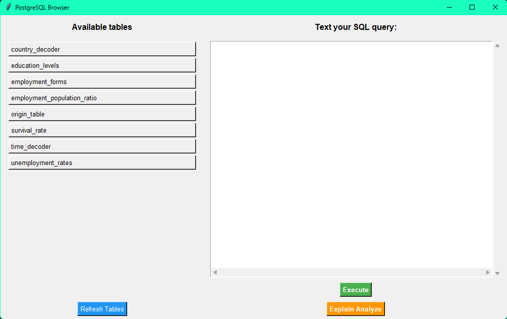
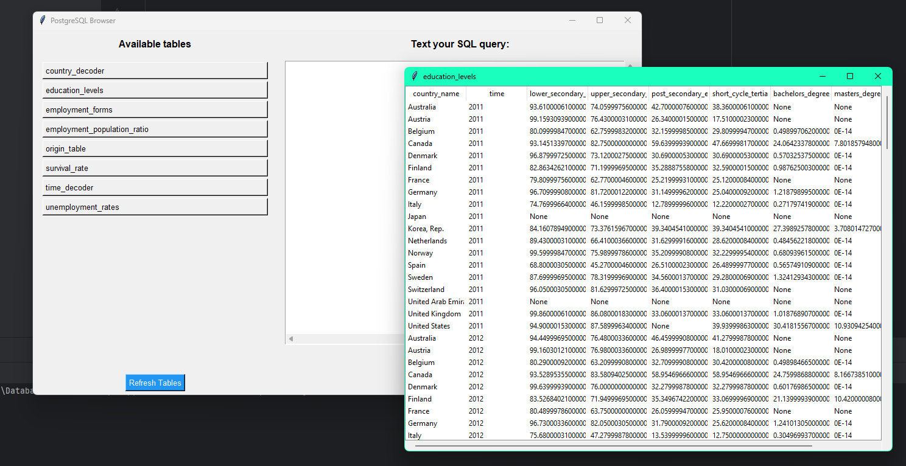
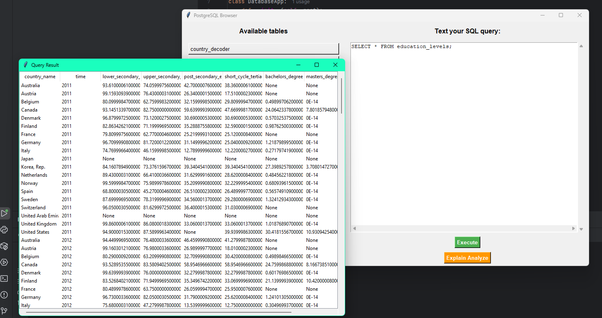

+++
date = 2025-06-26T00:00:00+03:00
draft = true
title = 'Соединение БД и кода'
description = "Последние обновления и прогресс в разработке проекта"
+++

# Готовое приложение: анализ социально-экономических данных
Мы завершили полнофункциональное desktop-приложение для анализа социально-экономических показателей стран. Вот что у нас получилось:

## 📊 Основные возможности
Работа с базой данных

Просмотр всех 7 таблиц (без написания SQL)

Фильтрация данных по странам и годам

Гибкие SQL-запросы

Встроенный редактор

Визуализация

Сравнение стран на одном поле

## Теперь хотелось бы продемонстрировать как выглядит наше приложение и какими функциями обладает:

### Интерфейс нашего приложения:

### Просмотр выбранной таблицы:

### Выполнение SQL-запросов:
